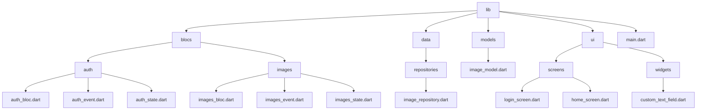

# PixelGate

A Flutter demo app showcasing:

- **Login screen** with form validation
- **BLoC** state management
- **Navigation** to a home screen on successful login
- **Image fetching** via API (Picsum)
- **Randomized image selection**
- Responsive, modern UI with **gradients**
- Grid layout (**2 images per row**)
- Drawer with **user icon** and **logout**
- **Pull-to-refresh** support

---


## ✨ Features

- **Form Validation**
  - Email must match valid email format.
  - Password rules:
    - Minimum of **8 characters**
    - At least **1 uppercase** letter
    - At least **1 lowercase** letter
    - At least **1 number**
    - At least **1 symbol**
- **Images**
  - Shows **10 random images** from top 100 Picsum results.
- **UI**
  - Gradient backgrounds (Login, Home, Drawer)
  - Rounded cards with shadows
  - Image overlay text
- **Drawer**
  - User icon at the top, logout button at the bottom
- **Hover effects** for buttons on desktop/web
- **Footer** on login page:  
  _© 2025 PixelGate. All Rights Reserved._

---

## 🛠 Tech Stack

- **Flutter** (Dart)
- **flutter_bloc**
- **http**
- **Picsum API** (https://picsum.photos)

---

## 📂 Project Structure


---

## 🚀 Getting Started

### 1️⃣ Prerequisites
- Flutter SDK installed ([Install Guide](https://docs.flutter.dev/get-started/install))
- Android Studio / Xcode for building
- Basic knowledge of Dart & Flutter

### 2️⃣ Install dependencies

flutter pub get

### 3️⃣ Run the app
```sh
flutter run
```

text

---

## 📦 Building APK

### Universal (fat) APK
```sh
flutter build apk
```

text
**Output:**  
`build/app/outputs/flutter-apk/app-release.apk`

---

### Split per ABI (smaller APKs)
flutter build apk --split-per-abi

text
**Output Directory:**  
`build/app/outputs/apk/release/`

Files:
- `app-armeabi-v7a-release.apk` (32-bit ARM)
- `app-arm64-v8a-release.apk` (64-bit ARM)
- `app-x86_64-release.apk` (x86 devices)

---

## 🔑 Validation Rules

- **Email Regex**:  
  `^[^@\s]+@[^@\s]+\.[^@\s]+$`
- **Password:**
  - Length >= 8
  - `[A-Z]` - uppercase letter
  - `[a-z]` - lowercase letter
  - `[0-9]` - number
  - `[!@#$%^&*(),.?":{}|<>]` - symbol

---

## 🌐 API Used

- **Picsum Photos API**:  
  Example endpoint:  
  `https://picsum.photos/v2/list?page=1&limit=100`

---

## 📜 License

This project is open-source under the MIT License.  
© 2025 **PixelGate** — All Rights Reserved.

---

## 📌 Trademark

> PixelGate is the project name used in this demo.  
> Ensure compliance with third-party licenses (e.g., Picsum).

---

